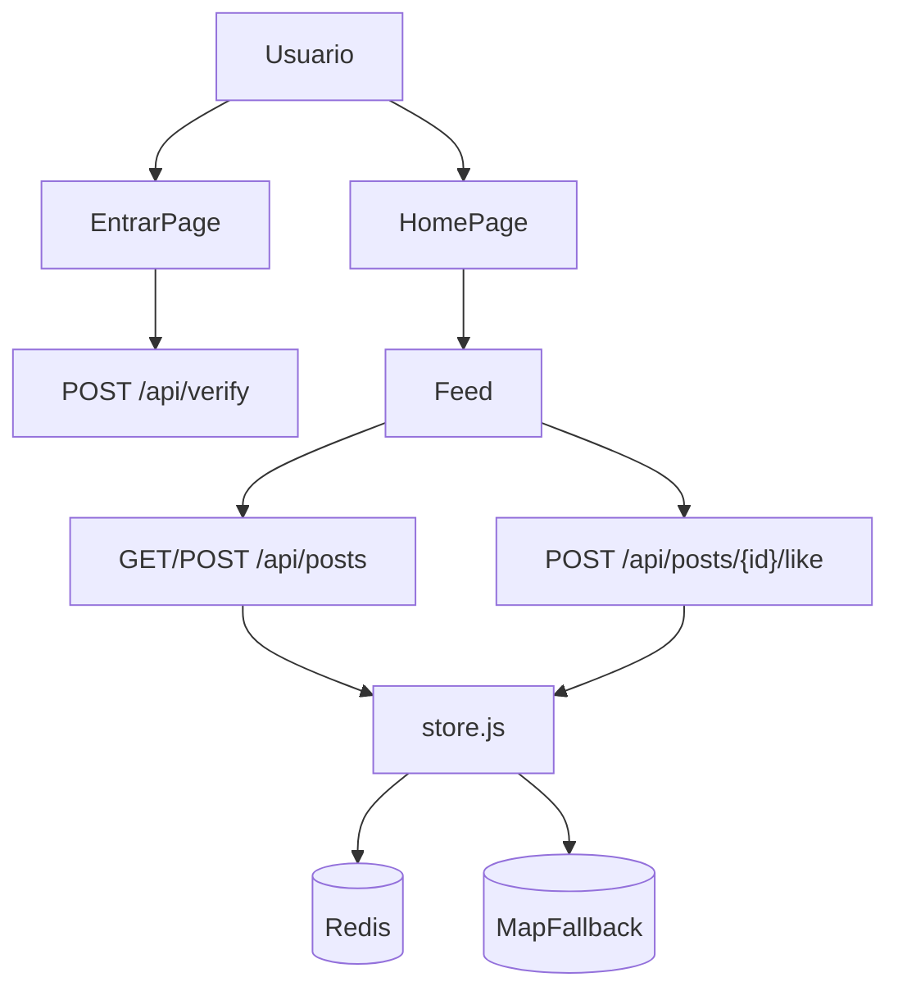

# Arquitectura

## Vista general

La aplicacion es un monolito web en Next.js: frontend y backend viven en el mismo repositorio y se despliegan juntos.

- UI y paginas en `src/app` y `src/components`.
- API HTTP en `src/app/api/**/route.js`.
- Reglas y configuracion en `src/lib/config.js`.
- Persistencia en `src/lib/store.js`.

## Componentes y responsabilidades

- `src/app/page.js`: gate principal que decide si mostrar acceso restringido o el feed.
- `src/app/entrar/page.js`: flujo de validacion de invitacion y alta local de visitante.
- `src/components/Feed.js`: formulario, listado, filtros, polling y estado visual del feed.
- `src/app/api/verify/route.js`: valida codigo de invitacion.
- `src/app/api/posts/route.js`: lista posts y crea posts con validaciones.
- `src/app/api/posts/[id]/like/route.js`: registra likes por visitante.
- `src/lib/store.js`: adaptador de datos (Redis o memoria local).

## Flujo end-to-end

## Decisiones arquitectonicas actuales

- API y UI unificadas para simplicidad operativa.
- Modelo de datos intencionalmente pequeno (sin ORM ni migraciones).
- Durabilidad opcional: con Redis los datos sobreviven reinicios; sin Redis no.
- Caducidad automatica de posts cada 24 horas.

## Limitaciones conocidas

- No hay autenticacion formal (JWT/sesion/OAuth); el acceso se basa en `localStorage`.
- No hay workers ni tareas en background dedicadas.
- No hay CI/CD definido en el repositorio.
